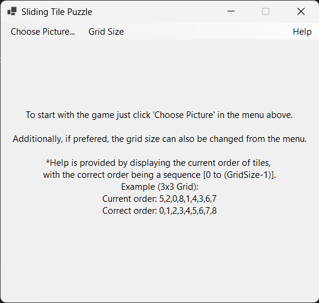
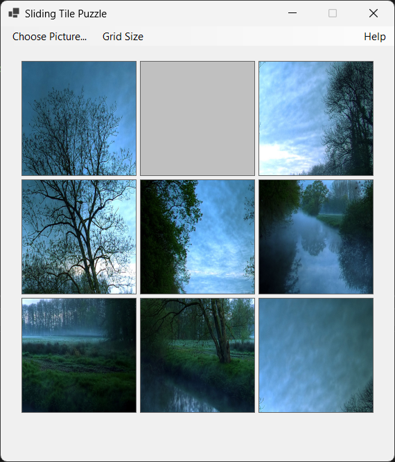
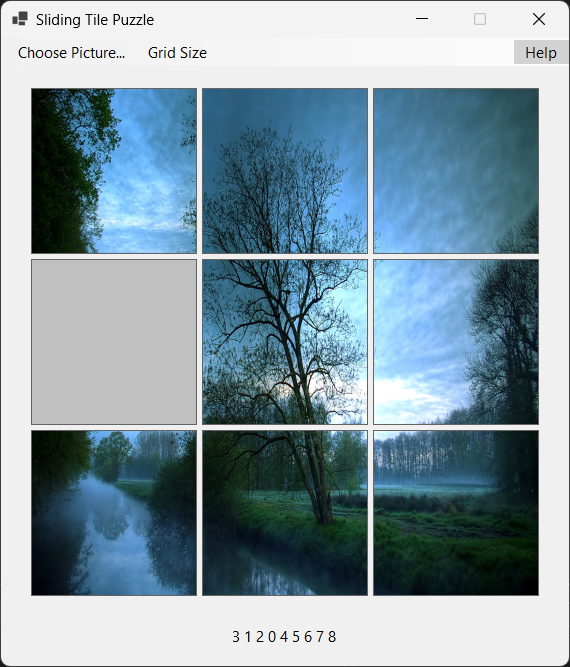
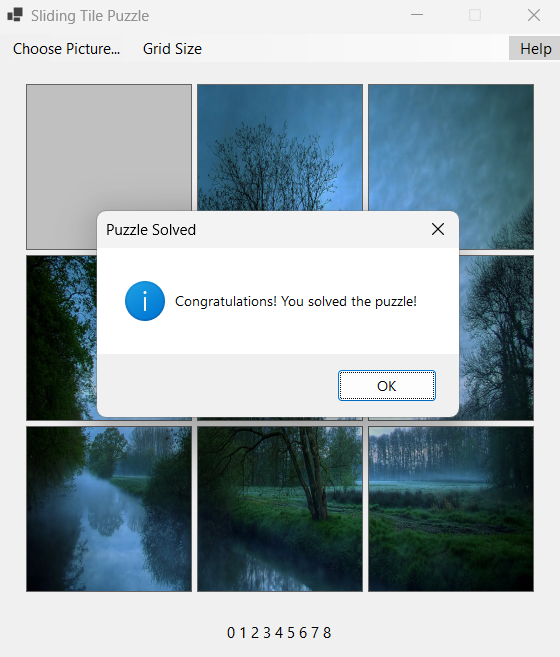
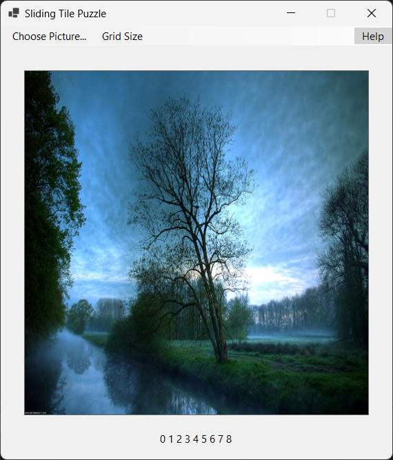
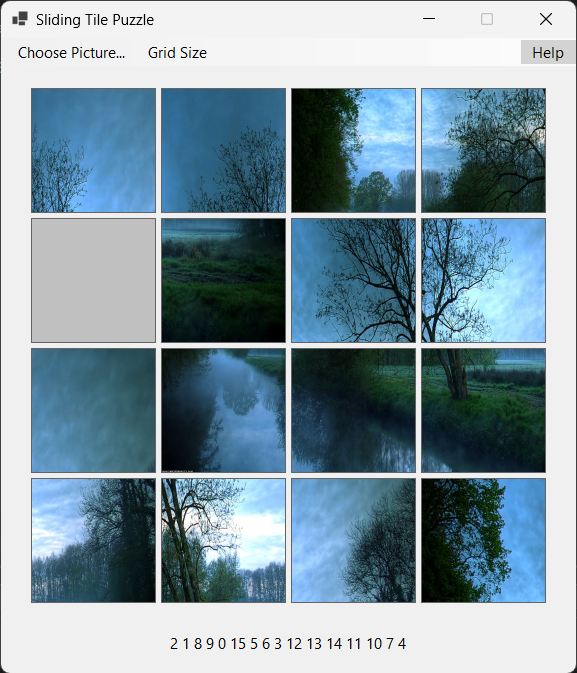
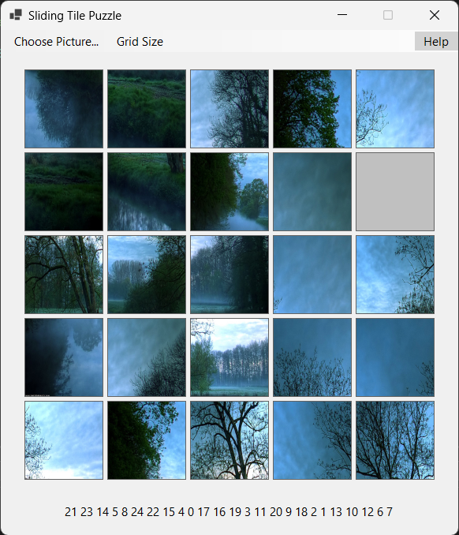

# Sliding Tile Puzzle Game Documentation

## Преглед
Овој репозиториум го содржи изворниот код за играта(сложувалката) со поместливи плочки развиена во C# користејќи Windows Forms во Visual Studio. Играта им овозможува на играчите да изберат слика, која потоа се дели на мрежа од плочки кои можат да се преместуваат и преуредуваат за да се реши сложувалката.

## Карактеристики
- **Избор на слика:** Изберете датотека со слика (JPEG, PNG, GIF) за да ја користите како сложувалка.
- **Прилагодлива големина на мрежа:** Променете ја големината на мрежата помеѓу опциите: 3x3, 4x4 и 5x5.
- **Мешање и решавање:** Автоматски мешање на плочки и осигурување дека сложувалката е решлива.
- **Интерактивна игра:** Кликнете на плочки кои се соседни со празната за да ги поместите.
- **Резултат на победа:** Се прикажува порака како и оригиналната слика откако ќе ја решите сложувалката.

## Употреба

### Избор на слика
1. Кликнете на опцијата "Choose Picture" во менито.
2. Изберете датотека со слика од вашиот компјутер.
3. Избраната слика ќе се вчита во мрежата на сложувалката.

### Решавање на сложувалката
- **Преместување на плочки:** Кликнете на било која плочка која е соседна со празната за да им ја замените позицијата.
- **Решавање на сложувалката:** Преуредете ги сите плочки во точниот редослед (0, 1, 2, ..., N-1) за да ја победите играта. (N од NxN, односно големината на мрежата)

### Промена на големина на сложувалката(мрежата)
- Користете ги опциите за "Grid Size" во менито (3x3, 4x4, 5x5) за да ја промените големината на мрежата на сложувалката.
- Ова ја ресетира тековната сложувалка и ви овозможува да започнете со нова големина на мрежата.

### Помош и Упатства
- Кликнете на опцијата "Help" во менито за да го прикажете или сокриете тековниот редослед  на плочките.
- Ова обезбедува упатство за решавање на сложувалката врз основа на тековниот редослед  на плочките.

## Слики (Screenshots)

>  **Note:** Изглед на формата на почеток.

>  **Note:** Изглед на формата откако избраната слика е вчитана.

>  **Note:** Изглед на формата откако ќе се активира помош, преку "Help" од менито.

>  **Note:** Изглед на формата еден чекор пред решавање на сложувалката.

>  **Note:** Изглед на формата кога сложувалката е решена.

>  **Note:** Изглед на формата кога сложувалката е решена и е кликнато ОК на пораката за успех.

>  **Note:** Изглед на формата кога сложувалката од тип 4x4.

>  **Note:** Изглед на формата кога сложувалката од тип 5x5.

